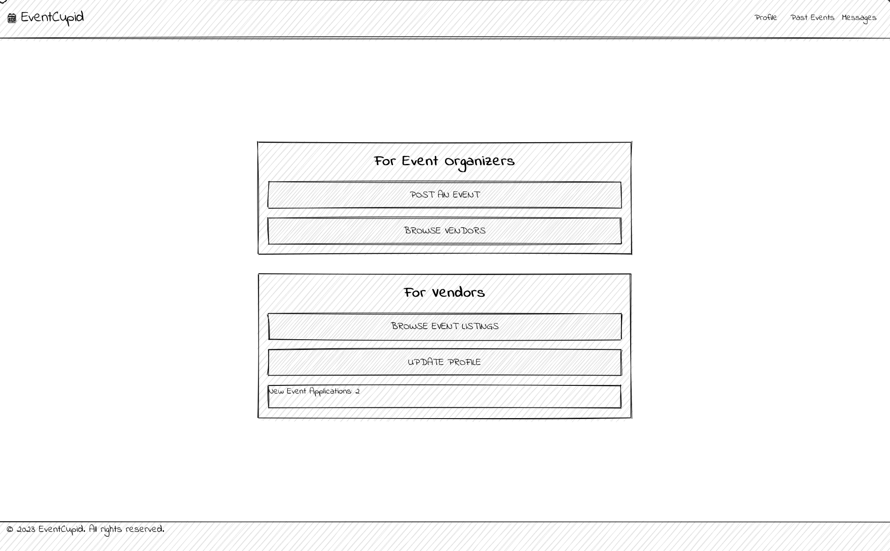
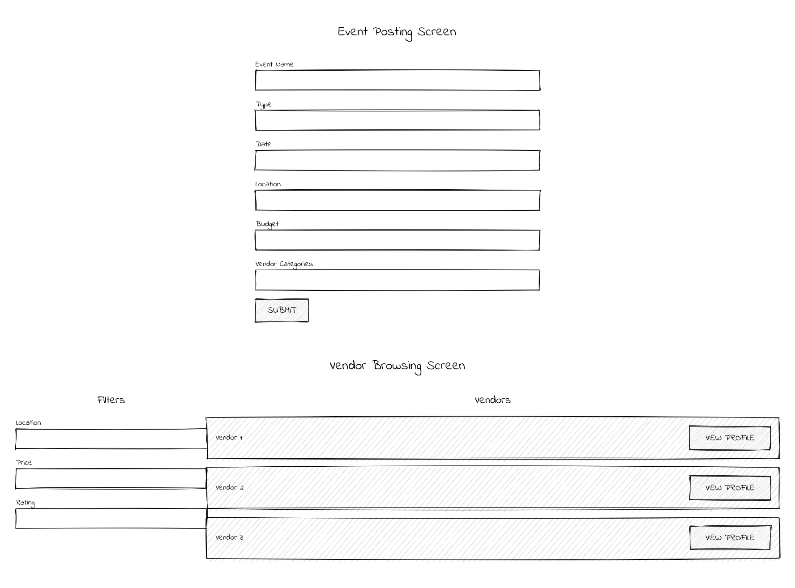
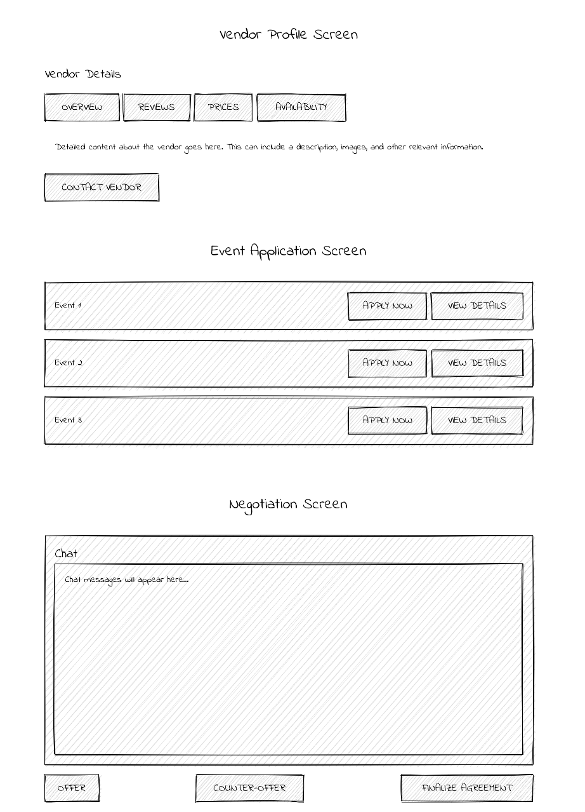

# EventCupid

## Project Summary
EventCupid is an application designed to simplify the event planning process by efficiently connecting event organizers with ideal venues and vendors. Many event organizers face challenges in finding ideal venues and vendors on time, complicating the planning process and causing events to be procrastinated. Based on our research, there are few corresponding applications that address these challenges efficiently. EventCupid therefore aims to fill this gap by providing an easy-to-use platform that quickly matches event organizers with the right venues and vendors tailored to their specific needs.

EventCupid offers a dual approach: For event organizers, the platform provides advanced filtering options, allowing them to search for vendors and venues based on criteria such as price, location, capacity, and event theme. They can either directly contact their preferred choices or list their events to receive applications from interested vendors and venues. On the vendor and venue side, they can showcase their services and wait for event organizers to reach out. Alternatively, they can actively browse through listed events and apply to these. 

## Description
Event organizers — whether planning a small birthday party, a large wedding, or university events — often struggle to find and coordinate with the right vendors and venues. This process is time-consuming and can result in increased costs and logistical challenges, especially when suitable services are not easily accessible or available within a specific budget. Many existing platforms also do not encourage collaboration between vendors and venues, missing the opportunity to offer organizers bundled packages that could save both time and money.

EventCupid aims to address these challenges by creating a centralized platform that connects event organizers with a network of vendors and venues. The application’s primary goal is to simplify and facilitate the event planning process by offering a comprehensive solution where organizers can find tailored services promptly and efficiently. Also, a key feature of EventCupid is its “Service Bundle” system, which allows vendors and venues to collaborate on packages for specific event types, thereby offering organizers cost-effective and cohesive solutions. This is aiming for vendors interested in bundling their services with other vendors or venues to enhance their offerings.

## Creative Components

### Service Bundle
1. **Vendor Perspective**  
   Vendors or venues have the option to enhance their offerings by creating a “bundle deal” underneath their services. A bundle deal is a collection of multiple services, either their own or from other vendors, offering at a reduced price compared to purchasing each service separately.
   - **Creating a Bundle with Own Services**: Vendors can combine their own services into a bundle and adjust the price to offer a more attractive deal.
   - **Creating a Bundle with Other Providers**: If the bundle includes services from different vendors or venues, a collaboration request is sent out to those providers to finalize the bundle.

   **Example Structure:** 	
   - **Service**:
     -  Bundle Service 1 ID
     -  Bundle Service 1 ID
     - Service ID
	- **BUNDLE SERVICE**  
    	- Bundle Service ID:
    	- Service 1 ID: provided by Vendor 1
    	- Service 2 ID: provided by Vendor 2
    	- Original Total Price: Sum of individual prices
    	- Bundle Price: Discounted package price

2. **Event Organizer Perspective**  
	For event organizers, bundled services are displayed together with individual services during their search. They can further refine their search to show only bundle deals if they are specifically looking for package options. This approach makes it easier for organizers to find cost-effective, comprehensive solutions that fit their event requirements.

### Price Negotiation
Instead of relying on static prices, the platform allows organizers and vendors/venue managers to negotiate prices directly through the system. This dynamic pricing feature involves:
1. **Real-Time Communication**: Vendors and organizers can engage in direct price negotiation using a built-in price agreement system, which records offers and counter-offers. 
2. **Automated Agreement System**: Once both parties agree on a price, the system finalizes the agreement and stores it in the database, keeping a record for future reference. It also ensures that the agreed-upon prices cannot be modified without mutual consent, ensuring transparency.
   
For instance, when a vendor is applying to an event, he can send a price quotation. Now if the organizer agrees to it, we will freeze the value and cannot be updated later. If he doesn’t agree, the organizer can send an updated price request. This will be continued until both parties agree on the prices.

### Sentiment Analysis and Review Summaries

To further assist event organizers in making informed decisions, the platform uses machine learning-based sentiment analysis to process feedback from previous users and provide a clear, concise summary of experiences with each vendor or venue manager. This feature involves:
1. **Sentiment Analysis**: The system collects user reviews and uses natural language processing (NLP) algorithms to analyze the sentiment behind the feedback (positive, negative, or neutral). It processes textual data to determine the general tone of user experiences.
2. **Experience Summary**: Instead of showing long, scattered reviews, the platform generates a summarized report that highlights key aspects of working with a specific vendor or venue manager. The system extracts useful insights, such as frequent compliments (e.g., "punctual," "high-quality service") or recurring complaints (e.g., "poor communication").

## Usefulness
EventCupid is designed to streamline and enhance the process of planning and managing events by offering a unified interface for event organizers, vendors, and venue managers. The application is useful because it simplifies the traditionally complex and fragmented process of coordinating with multiple service providers, making event planning more efficient and effective.

### Functionalities
1. User Registration & Profiles
   * Vendors, venue managers, and event organizers can create detailed profiles. Vendors and venue managers list their services, pricing, and availability, while organizers can manage event postings.

2. Event Posting and Vendor/Venue Selection:
   * Event organizers can post events and easily browse through vendor and venue options. Organizers can filter by service type, location, pricing, and availability.
3. Vendor and Venue Applications:
   * Vendors and venue managers can apply for events directly once an organizer posts an event. This two-way interaction enables a more dynamic and competitive process.
4. Ratings & Reviews:
   * Event organizers can leave feedback and rate vendors and venues, helping future organizers make informed decisions.

### Role-wise Functionalities
Attributes and functionalities for **VENDORS** :
* Vendor agency name
* Contact details (email and phone number)
* Locations where service is offered
* Service Category (Food, decoration, sound, lights, etc)
* Service charges (Fixed + variable)
* Reviews of past organizers catered visible on their profile
* Browse events posted by organizers and apply for it if qualified

Attributes and functionalities for **VENUE MANAGERS** :
* Venue name
* Venue address
* Contact details (email and phone number)
* Reviews of past organizers catered visible on their profile
* Browse events posted by organizers and apply for it if qualified

Attributes and functionalities for **EVENT ORGANIZERS** :
* Browse venues based on Location filter
* Browse vendors filtered by their service categories and Locations
* Post events so as to notify the vendors and venues about it
* Choice of selecting vendors and venues who applied for the event posted
* Provide reviews on vendors and venue profiles

Moving to further project stages:
1. We plan to use all the CRUD operations on this data. Accounts can be created, updated and deleted. 
2. Further, we will also apply DB level constraints and Access levels for users to have confidentiality and entitlements. 

## Realness
* The format of the data will be .csv.
* The dataset has a cardinality of around 1000 and has a degree of 15.

* The columns which are included in the dataset are: 
  - Username (VARCHAR)
  - Email (VARCHAR)
  - Phone number (VARCHAR)
  - User Type (ENUM)
  - Date of joining (TIMESTAMP)
  - Vendor Name (VARCHAR)
  - Services offered by vendor (VARCHAR)
  - Locations serviced by vendor (VARCHAR)
  - Service Charges of vendor (VARCHAR)
  - Total reviews received (INT)
  - Average rating (DECIMAL)
  - Name of venue (VARCHAR)
  - Address of venue (VARCHAR)
  - Maximum Capacity (INT)

AI will be used to generate the dataset through the [mockaroo](http://www.mockaroo.com/) website.

## Functionality
1) Event Organizers:
   * Event organizers sign up by creating detailed profiles that highlight their event type preferences, location, and budget.
	* Organizers can post new events, specifying the type of event (wedding, conference, etc.), the budget, and the requirements for vendors and venues.
	* They can browse available vendors and venues based on their criteria such as location, pricing, and services offered (e.g., catering, lights, sound).
	* Organizers can invite vendors or venues to apply for their event, or they can wait for vendors/venues to send applications.
	* They have the ability to review vendor profiles, check their ratings, and compare services based on past reviews and available offerings.
	* Price Negotiation Feature: Organizers can engage in real-time price negotiations with vendors/venues, ensuring flexible budgeting.
	* After the event, organizers can leave reviews and rate the vendors and venues to help other users make informed decisions.
2) Vendors & Venue Managers:
	* Vendors and venue managers register by creating profiles that list their services, prices, and availability.
	* Vendors can apply for listed events if they match the requirements posted by the event organizers.
	* Service Bundle Creation: Vendors can collaborate with venues to offer bundled services, which provide discounted packages for organizers.
	* Vendors and venues can communicate with organizers through the platform to clarify event details, availability, and special requests.
	* After the event, they can view feedback provided by the organizer and adjust their profiles or offerings accordingly.
3.	Create:
	* User Profiles: Event organizers, vendors, and venue managers can create accounts and profiles with details about their services, locations, and prices.
	* Event Listings: Organizers can create new event posts, specifying the type of event, required services, and budget.
	* Vendor Services: Vendors can create and list services they offer, including pricing details and package options.
	* Service Bundles: Vendors and venues can collaborate and create bundled service offers.
4.	Read:
	* Browse Vendors & Venues: Event organizers can search and filter vendor and venue profiles based on criteria like location, services offered, price, and user ratings.
	* View Event Listings: Vendors and venues can browse events listed by organizers and decide which events to apply for.
	* Review Summaries: Organizers can read sentiment-based reviews and summaries of past users’ feedback about vendors and venues.
5.	Update:
	* Profile Updates: Users (organizers, vendors, and venues) can update their profiles, including adding new services, adjusting prices, and availability.
	* Event Updates: Organizers can modify event details, such as changing the date, location, or adding more service requirements.
	* Price Negotiation: Vendors and organizers can engage in real-time price negotiations, allowing dynamic price adjustments.
6.	Delete:
	* Delete Accounts: Users can delete their accounts if they no longer want to participate in the platform.
	* Cancel Event Listings: Event organizers can cancel event posts if the event is no longer happening.
	* Withdraw Applications: Vendors can withdraw their applications from events they no longer want to participate in.
## Low fidelity UI mockup

## Work distribution
- Data modeling and design - Everyone
- Data generation using Mockaroo - Aryaman Nasare, Sudarshan Shinde
- Front-end (UI) - Multiple screens and a landing page - Sunveg Nalwar, Lijun Zhu
- Backend 
  - Vendor - Sudarshan Shinde
  - Venue manager - Aryaman Nasare
  - Event Organizer - Lijun Zhu
  - Review summary and sentiment analysis - Sunveg Nalwar
