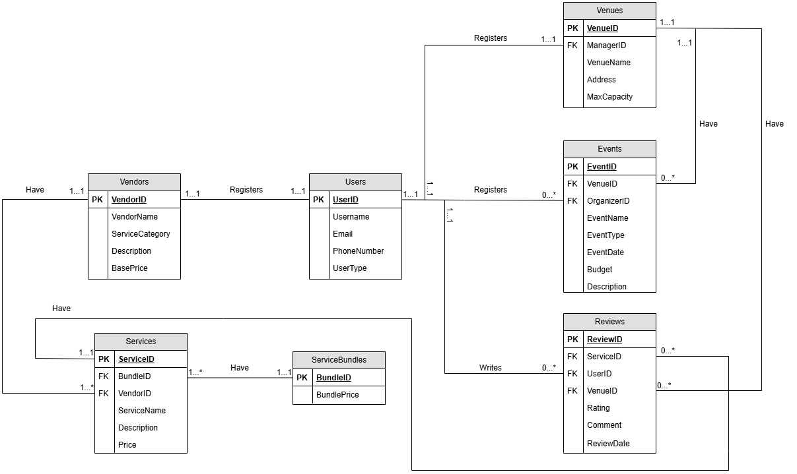

## UML Diagram


## Entities and Assumptions
1. User: This entity represents individuals registered in the EventCupid system. A user can be an organizer or a venue manager/vendor.
   * Assumptions:
     1. Uniqueness: Each user is uniquely identified by a **UserId**.
     2. Contact Information Validity: Users must provide valid email and phone numbers for communication.
     3. UserType: Differentiates between organizers and venue/vendor managers.

2. Venue: This entity captures information about venues available on EventCupid for events.
   * Assumptions:
     1. Uniqueness: Each venue is uniquely identified by **VenueID**.
     2. Venue Capacity: Each venue has a specified maximum capacity, helping organizers choose suitable venues.

3. Vendor: This entity stores information about service providers who offer services related to events.
   * Assumptions:
     1. Uniqueness: Each vendor is identified by **VendorID**.
     2. Service Category: Each vendor provides services categorized (e.g., catering, decoration) for easy searchability.
     3. Base Price: Vendors specify a base price for their services, which may be negotiated with users.

4. Services: This entity represents individual services offered by vendors. Each service belongs to a vendor and can be part of a service bundle.
   * Assumptions:
     1. Uniqueness: Each service is identified by **ServiceID**.
     2. Vendor Dependency: Each service is offered by exactly one vendor.
     3. Bundle Association: Services can be grouped into bundles, providing discounts or combined offerings.
     4. Null-ity: BundleId can be null, where services are not a part of any ServiceBundle

5. Events: This entity represents events created by users. An event is hosted at only one venue and organized by only one user.
   * Assumptions:
     1. Uniqueness: Each event is uniquely identified by **EventID**.
     2. Organizer Dependency: Each event is created by only one organizer.
     3. Venue Dependency: An event must be assigned to a single venue.

6. ServiceBundles: This entity represents groups of services that vendors can offer as packages. We have a separate ServiceBundles table instead of an attribute in Services. The reason is that we want to look up if ServiceBundleId exists in this table. Only then we want to query the Services. We have designed it this way because we think we might use a functionality just to check the existence, and then use UI filtering based on that.
   * Assumptions:
     1. Uniqueness: Each bundle is identified by **BundleID**.
     2. Bundle Price: A fixed price for the service package is specified.
7. Reviews: This entity stores reviews written by users, either for services or venues.
   * Assumptions:
     1. Uniqueness: Each review is uniquely identified by **ReviewID**.
     2. Optional Venue/Service: A review can be for either a service or a venue. The **VenueID** or **ServiceID** can be null depending on which is being reviewed.

## Relations
1. User and Events:
   * A User can create 0 or more Events (Zero-to-Many)
   * An Event is created by exactly 1 User (One-to-One)
2. User and Reviews:
   * A User can write 0 or more Reviews (Zero-to-Many)
   * A Review is written by exactly 1 User (One-to-One)
3. Venue and Events:
   * A Venue can host 0 or more Events (Zero-to-Many)
   * An Event is hosted at exactly 1 Venue (One-to-One)
4. Venue and Reviews:
   * A Venue can receive 0 or more Reviews (Zero-to-Many)
   * A Review for a venue is associated with exactly 1 Venue (One-to-One)
5. Vendor and Services:
   * A Vendor can offer 1 or more Services (One-to-Many)
   * A Service belongs to exactly 1 Vendor (One-to-One)
6. Service and Reviews:
   * A Service can receive 0 or more Reviews (Zero-to-Many)
   * A Review for a service is associated with exactly 1 Service (One-to-One)
7. ServiceBundles and Services:
   * A ServiceBundle includes 1 or more Services (One-to-Many)
   * A Service can belong to 1 ServiceBundle (if exists) (One-to-One)
  
## Normalization 
Functional Dependencies:
* UserID → Name, Email, PhoneNumber
* VenueID → ManagerID, VenueName, Address, MaxCapacity
* VendorID → VendorName, ServiceCategory, Description, BasePrice
* ServiceID → VendorID, ServiceName, Price
* EventID → VenueID, OrganizerID, EventName, EventType, EventDate, Budget, Description
* ReviewID → UserID, Rating, Comment, ReviewDate

Normalization (3NF):
* Each table is in Third Normal Form (3NF) since all non-key attributes depend only on the primary key.
* No transitive dependencies exist among non-key attributes.

BCNF Checks:

Relation 1: Users
   * Schema:
     * Users(UserID, Username, Email, PhoneNumber, UserType)
   * Candidate Key:
     * UserID is the candidate key.
   * Functional Dependencies:
     * UserID → Username, Email, PhoneNumber, UserType (Each attribute depends on the UserID).
   * BCNF Check:
     * The functional dependencies show that UserID is a superkey, and all other attributes depend on it.
     * Conclusion: This relation is in BCNF because all FDs have a superkey on the left-hand side.

Relation 2: Venues
  * Schema:
    * Venues(VenueID, ManagerID, VenueName, Address, MaxCapacity)
  * Candidate Key:
    * VenueID is the candidate key.
  * Functional Dependencies:
    * VenueID → ManagerID, VenueName, Address, MaxCapacity (Each venue has one manager and a unique set of properties).
  * BCNF Check:
    * VenueID is a superkey, and all other attributes depend on it.
    * Conclusion: This relation is in BCNF because all non-prime attributes are fully dependent on the superkey (VenueID).

Relation 3: Vendors
   * Schema:
     * Vendors(VendorID, VendorName, ServiceCategory, Description, BasePrice)
   * Candidate Key:
     * VendorID is the candidate key.
   * Functional Dependencies:
     * VendorID → VendorName, ServiceCategory, Description, BasePrice (All attributes are fully determined by the vendor ID).
   * BCNF Check:
     * VendorID is a superkey, and all other attributes depend on it.
     * Conclusion: This relation is in BCNF because all functional dependencies are based on the superkey (VendorID).

Relation 4: Services
   * Schema:
     * Services(ServiceID, VendorID, ServiceName, Price)
   * Candidate Key:
     * ServiceID is the candidate key.
   * Functional Dependencies:
     * ServiceID → VendorID, ServiceName, Price (Each service is tied to a vendor and has a unique name and price).
   * VendorID → ServiceName, Price is not a valid functional dependency because a vendor can offer multiple services with different names and prices.
   * BCNF Check:
     * ServiceID is a superkey, and all other attributes depend on it.
     * Conclusion: This relation is in BCNF because all functional dependencies have a superkey on the left-hand side.

Relation 5: ServiceBundles
   * Schema:
     * ServiceBundles(BundleID, BundlePrice)
   * Candidate Key:
     * BundleID is the candidate key.
   * Functional Dependencies:
     * BundleID → BundlePrice (The price is determined by the bundle ID).
   * BCNF Check:
     * BundleID is a superkey, and the other attribute (BundlePrice) depends on it.
     * Conclusion: This relation is in BCNF.

Relation 6: Events
   * Schema:
     * Events(EventID, VenueID, OrganizerID, EventName, EventType, EventDate, Budget, Description)
   * Candidate Key:
     * EventID is the candidate key.
   * Functional Dependencies:
     * EventID → VenueID, OrganizerID, EventName, EventType, EventDate, Budget, Description (Each event has a unique identifier, and the attributes are fully dependent on it).
   * BCNF Check:
     * EventID is a superkey, and all other attributes depend on it.
     * Conclusion: This relation is in BCNF.

Relation 7: Reviews
   * Schema:
     * Reviews(ReviewID, ServiceID, VenueID, UserID, Rating, Comment, ReviewDate)
   * Candidate Key:
     * ReviewID is the candidate key.
   * Functional Dependencies:
     * ReviewID → ServiceID, VenueID, UserID, Rating, Comment, ReviewDate (Each review is uniquely identified by  ReviewID, and the attributes are fully dependent on it).
   * BCNF Check:
     * ReviewID is a superkey, and all other attributes depend on it.
     * Conclusion: This relation is in BCNF.

### Conclusion
All relations in our database schema are in BCNF. There are no violations of BCNF, meaning:
* Every non-trivial functional dependency has a superkey on the left-hand side.
* All non-prime attributes are fully functionally dependent on the candidate keys.

## Relational Schema
```
Users( UserID: INT [PK], Username: VARCHAR(50), Email: VARCHAR(100), PhoneNumber: VARCHAR(20), UserType: ENUM('Organizer', 'Manager') )

Venues( VenueID: INT [PK], ManagerID: INT [FK to Users.UserID], VenueName: VARCHAR(100), Address: VARCHAR(500), MaxCapacity: INT )

Vendors( VendorID: INT [PK], VendorName: VARCHAR(100), ServiceCategory: VARCHAR(50), Description: VARCHAR(500), BasePrice: DECIMAL(10, 2) )

Services( ServiceID: INT [PK], VendorID: INT [FK to Vendors.VendorID], ServiceName: VARCHAR(100), Price: DECIMAL(10, 2) )

ServiceBundles( BundleID: INT [PK], BundlePrice: DECIMAL(10, 2) )

Events( EventID: INT [PK], VenueID: INT [FK to Venues.VenueID], OrganizerID: INT [FK to Users.UserID], EventName: VARCHAR(100), EventType: VARCHAR(50), EventDate: DATE, Budget: DECIMAL(10, 2), Description: VARCHAR(500) )

Reviews( ReviewID: INT [PK], ServiceID: INT [FK to Services.ServiceID, Nullable], VenueID: INT [FK to Venues.VenueID, Nullable], UserID: INT [FK to Users.UserID], Rating: INT, Comment: VARCHAR(1000), ReviewDate: DATE )
```
