# Database Implementation
## 1. Database Connection
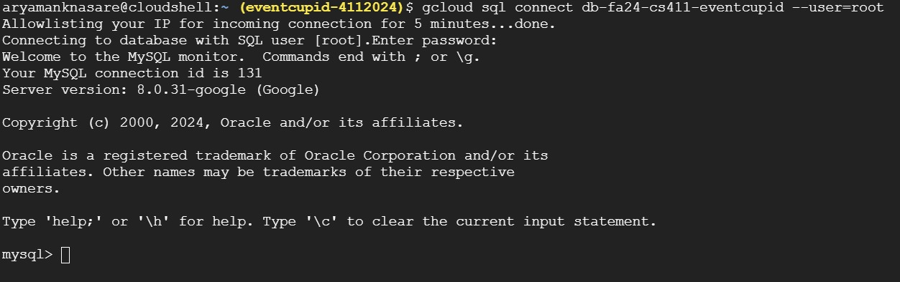
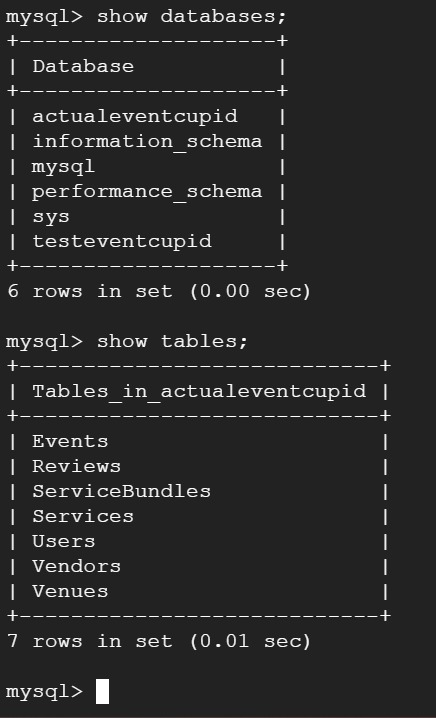


## 2. Table Structure and DDL Commands
```sql
CREATE TABLE Users (
    UserID INT PRIMARY KEY,
    Username VARCHAR(50),
    Email VARCHAR(100),
    PhoneNumber VARCHAR(20),
    UserType ENUM('Organizer', 'Manager')
);

CREATE TABLE ServiceBundles (
    BundleID INT PRIMARY KEY,
    BundlePrice DECIMAL(10, 2)
);

CREATE TABLE Venues (
    VenueID INT PRIMARY KEY,
    ManagerID INT,
    VenueName VARCHAR(100),
    Address VARCHAR(500),
    MaxCapacity INT,
    FOREIGN KEY (ManagerID) REFERENCES Users(UserID)
);

CREATE TABLE Vendors (
    VendorID INT PRIMARY KEY,
    VendorName VARCHAR(100),
    ServiceCategory VARCHAR(50),
    Description VARCHAR(500),
    BasePrice DECIMAL(10, 2)
);

CREATE TABLE Services (
    ServiceID INT PRIMARY KEY,
    VendorID INT DEFAULT NULL,
    BundleID INT DEFAULT NULL,
    ServiceName VARCHAR(100),
    Description VARCHAR(500),
    Price DECIMAL(10, 2),
    FOREIGN KEY (VendorID) REFERENCES Vendors(VendorID) ON DELETE CASCADE,
    FOREIGN KEY (BundleID) REFERENCES ServiceBundles(BundleID) ON DELETE CASCADE
);

CREATE TABLE Events (
    EventID INT PRIMARY KEY,
    VenueID INT,
    OrganizerID INT,
    EventName VARCHAR(100),
    EventType VARCHAR(50),
    EventDate DATE,
    Budget DECIMAL(10, 2),
    Description VARCHAR(500),
    FOREIGN KEY (VenueID) REFERENCES Venues(VenueID) ON DELETE CASCADE,
    FOREIGN KEY (OrganizerID) REFERENCES Users(UserID) ON DELETE CASCADE
);

CREATE TABLE Reviews (
    ReviewID INT PRIMARY KEY,
    ServiceID INT,
    VenueID INT,
    UserID INT,
    Rating INT,
    Comment VARCHAR(1000),
    ReviewDate DATE,
    FOREIGN KEY (ServiceID) REFERENCES Services(ServiceID) ON DELETE CASCADE,
    FOREIGN KEY (VenueID) REFERENCES Venues(VenueID) ON DELETE CASCADE,
    FOREIGN KEY (UserID) REFERENCES Users(UserID) ON DELETE CASCADE
);
```

## 3. Table Counts

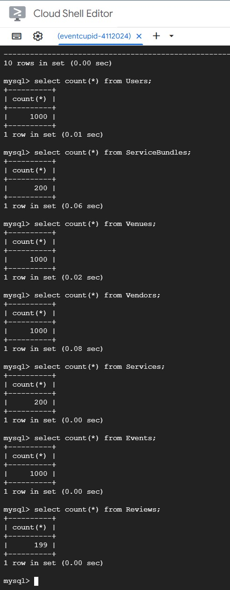


# Advanced Queries
## Query 1
- The purpose of this query is to retrieve the top 15 venues that have an average review rating of at least 2, along with their addresses, total service costs, and the number of recent events hosted by organizers. The query filters for venues with a maximum capacity greater than 50, includes only recent reviews (from September 10, 2024, onward), and considers venues that have a total service cost exceeding 100. It aims to identify venues that are well-rated and actively hosting events while ensuring a reasonable service cost.

- Index on : v.MaxCapacity, r.ReviewDate, (r.ReviewDate, r.Rating)
CREATE INDEX idx_venues_maxcapacity ON Venues (MaxCapacity);

CREATE INDEX idx_reviews_reviewdate ON Reviews (ReviewDate);

CREATE INDEX idx_reviews_reviewdate_rating ON Reviews (ReviewDate, Rating);


```sql
SELECT 
    v.VenueName,
    v.Address,
    AVG(r.Rating) AS AvgRating,
    COUNT(r.ReviewID) AS ReviewCount,
    SUM(s.Price) AS TotalServiceCost,
    (SELECT COUNT(*) 
     FROM Events e 
     JOIN Users u ON e.OrganizerID = u.UserID
     WHERE e.VenueID = v.VenueID 
       AND e.EventDate >= '2024-01-01'
    ) AS RecentOrganizerEvents
FROM 
    Venues v
JOIN 
    Reviews r ON v.VenueID = r.VenueID
JOIN 
    Services s ON s.BundleID IN (
        SELECT BundleID 
        FROM ServiceBundles
        WHERE BundlePrice > 50
    )
WHERE 
    v.MaxCapacity > 50
    AND r.ReviewDate >= '2024-09-10'
    AND r.Rating >= 2  -- only high-rated reviews
GROUP BY 
    v.VenueID
HAVING 
    AVG(r.Rating) >= 2.0
    AND RecentOrganizerEvents >= 2  -- Only venues with at least 3 recent organizer-hosted events
    AND TotalServiceCost > 100  -- Only  venues with bundled services over a certain cost
ORDER BY 
    AvgRating DESC, 
    ReviewCount DESC
LIMIT 15;

```

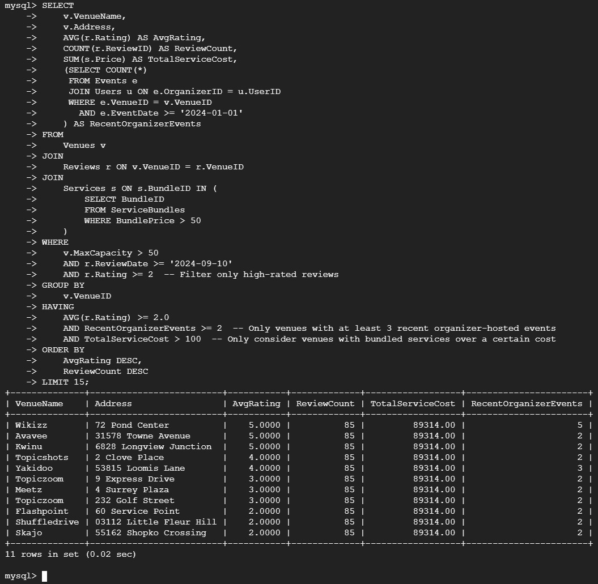

## Query 2
- This query helps identify the most active event organizers by summarizing their performance metrics, such as total events, budgets, and reviews. By focusing on organizers who host events in larger venues and have a substantial number of events, it provides insights into which organizers are effectively managing events and could be valuable partners for future collaborations or promotions. This information can aid decision-making for event planning, marketing strategies, and resource allocation.

```sql
SELECT 
    u.Username,
    COUNT(e.EventID) AS EventCount,
    SUM(e.Budget) AS TotalBudget,
    AVG(e.Budget) AS AvgBudget,
    (SELECT COUNT(*) 
     FROM Reviews r 
     WHERE r.UserID = u.UserID) AS ReviewCount,
    (SELECT COUNT(*) 
     FROM Events e2 
     WHERE e2.OrganizerID = u.UserID AND e2.EventDate >= '2024-01-01') AS RecentEventsCount
FROM 
    Users u
JOIN 
    Events e ON u.UserID = e.OrganizerID
JOIN 
    Venues v ON e.VenueID = v.VenueID
WHERE 
    u.UserType = 'Organizer'
    AND e.EventDate >= '2023-01-01'  -- Only consider events from the last year
    AND v.MaxCapacity > 80  -- Only include events in larger venues
GROUP BY 
    u.UserID
HAVING 
    EventCount > 2  -- Only include organizers with more than 2 events
ORDER BY 
    EventCount DESC, TotalBudget DESC
LIMIT 15;


```
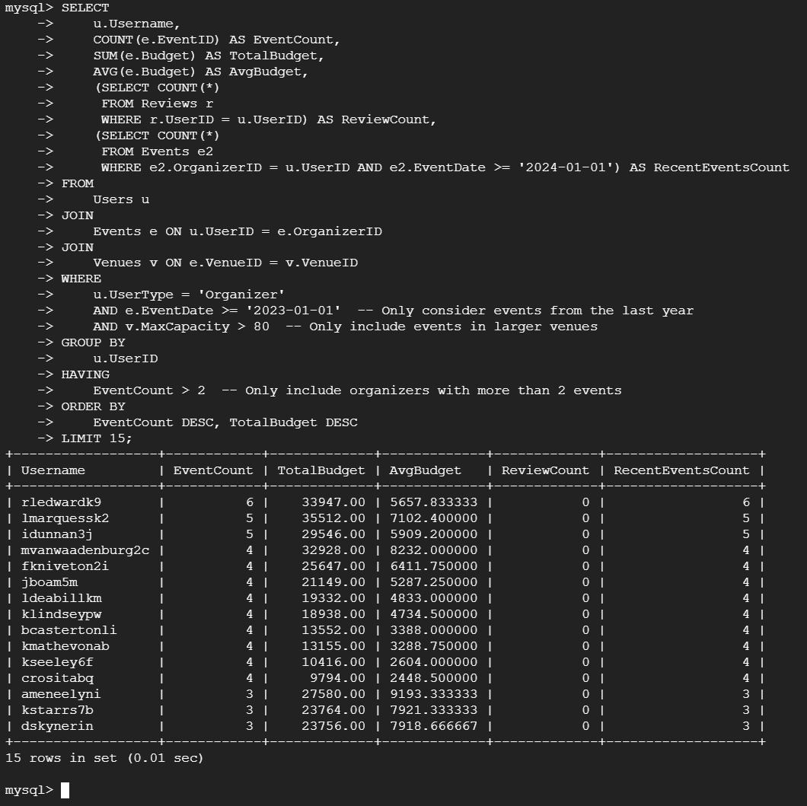

## Query 3
- This query retrieves venues with a capacity greater than 100 and filters for upcoming events on or after 2024-09-17, without restricting the results to a specific manager. 

```sql
SELECT 
    v.VenueName,
    COUNT(e.EventID) AS TotalEvents,
    AVG(e.Budget) AS AverageBudget
FROM 
    Venues v
JOIN 
    Events e ON v.VenueID = e.VenueID
WHERE 
    v.MaxCapacity > 100  -- venues with capacity greater than 100
    AND e.EventDate >= '2024-09-17'  -- Filter for upcoming events
GROUP BY 
    v.VenueID
ORDER BY 
    TotalEvents DESC
LIMIT 15;

```
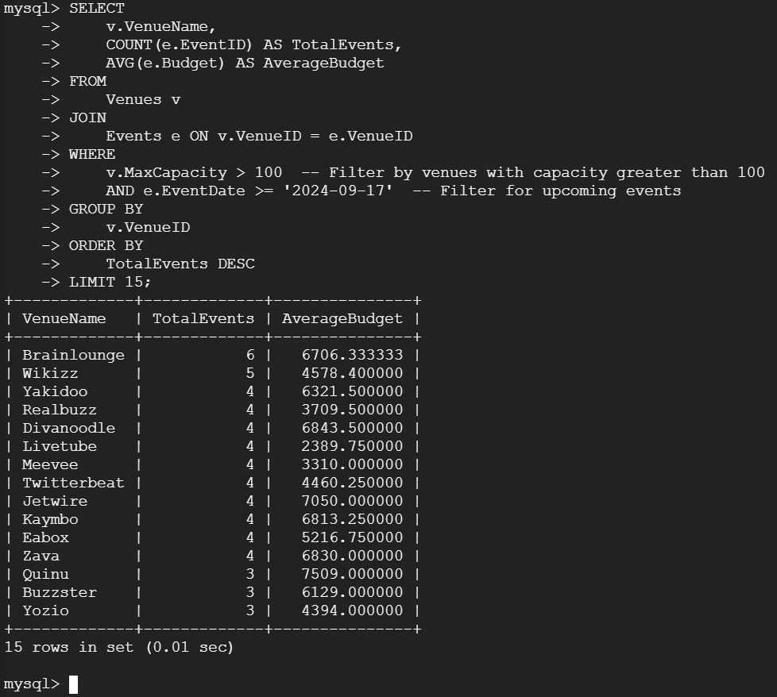

## Query 4
- This query lists vendors within the same service category who have similar ratings, allowing organizers to explore comparable options.

```sql
SELECT 
    v1.VendorName AS Vendor1,
    v2.VendorName AS Vendor2,
    v1.ServiceCategory,
    AVG(r1.Rating) AS Vendor1AverageRating,
    AVG(r2.Rating) AS Vendor2AverageRating,
    ABS(AVG(r1.Rating) - AVG(r2.Rating)) AS RatingDifference
FROM 
    Vendors v1
JOIN 
    Services s1 ON v1.VendorID = s1.VendorID
JOIN 
    Reviews r1 ON s1.ServiceID = r1.ServiceID
JOIN 
    Vendors v2 ON v1.ServiceCategory = v2.ServiceCategory AND v1.VendorID != v2.VendorID
JOIN 
    Services s2 ON v2.VendorID = s2.VendorID
JOIN 
    Reviews r2 ON s2.ServiceID = r2.ServiceID
GROUP BY 
    v1.VendorID, v2.VendorID
HAVING 
    RatingDifference <= 0.5 --  vendors with close average ratings
ORDER BY 
    v1.ServiceCategory, RatingDifference
LIMIT 15;


```
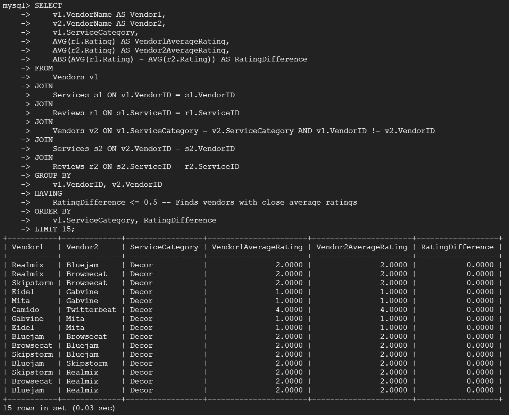


# Indexing 

- ## Query 1 : Vanilla Query performance before indexing
  The vanilla query’s performance is based on the dataset size and filtering operations without any indexing. This baseline provides insight into the query performance without any optimization.
  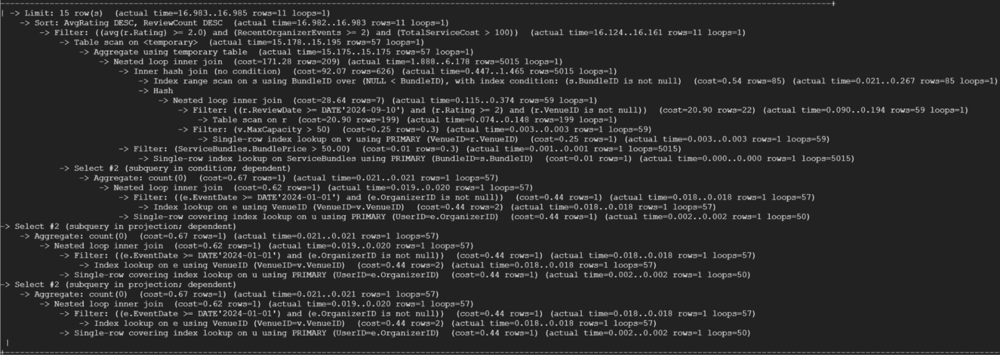
  ## Index 1 : CREATE INDEX idx_venues_maxcapacity ON Venues (MaxCapacity);
  ### Reason for No Improvement:
    - The MaxCapacity column in the Venues table might not have been heavily used in filtering or sorting operations in this query. If MaxCapacity is not involved in frequent or large-scale filtering (i.e., the query doesn't frequently filter by MaxCapacity), the index will have little effect on the performance.
    - Given the small dataset size, the database engine might have performed a full scan without noticeable performance issues, negating the impact of the index.
  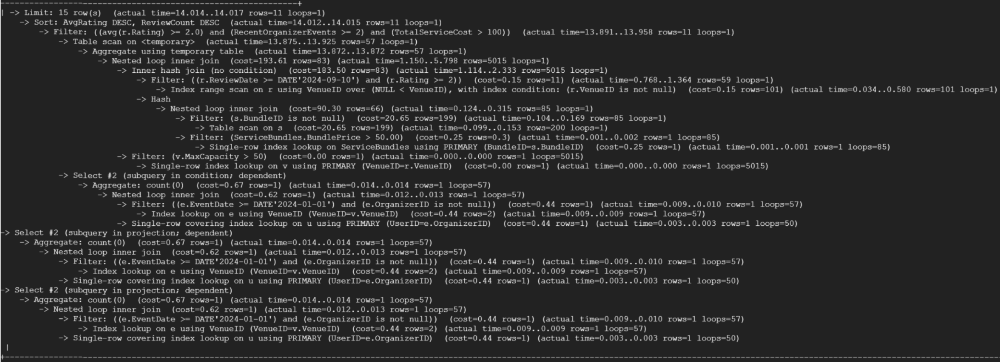

  ## Index 2 : CREATE INDEX idx_reviews_reviewdate ON Reviews (ReviewDate);
  ### Reason for No Improvement:
    - Similar to the MaxCapacity index, if the ReviewDate column isn't actively involved in filtering or sorting in the query, the index won’t contribute to performance improvements.
    - If the ReviewDate is used in very few rows, the optimizer may decide that a table scan is just as efficient, especially in smaller datasets like ours.
  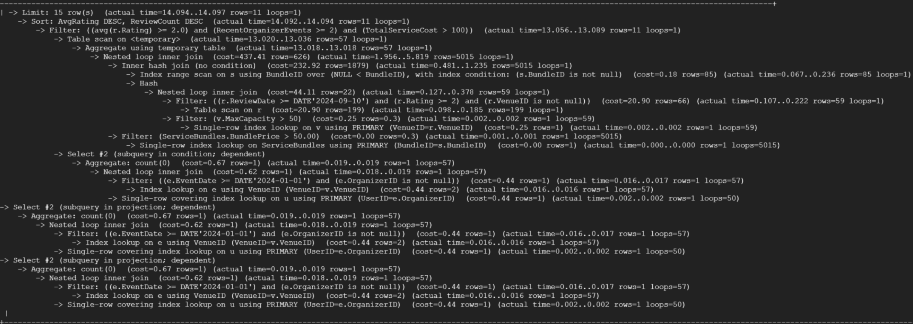

  ## Index 3 : CREATE INDEX idx_reviews_reviewdate_rating ON Reviews (ReviewDate, Rating);
  ### Reason for No Improvement:
    - While this composite index involves both ReviewDate and Rating, it's only effective when both columns are heavily used in filtering or sorting. If the query does not filter or sort by both columns or if the dataset is small, the index does not provide a significant performance benefit.
    - The small dataset size likely means the database could handle the query efficiently even without the index.
  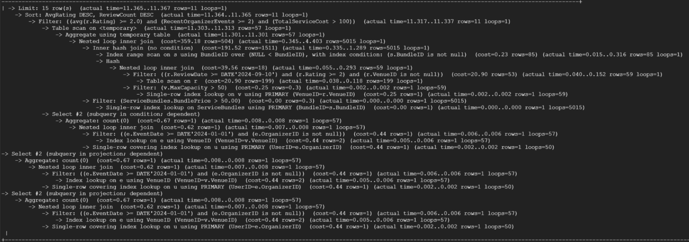

- ## Query 2 : Vanilla Query performance before indexing
  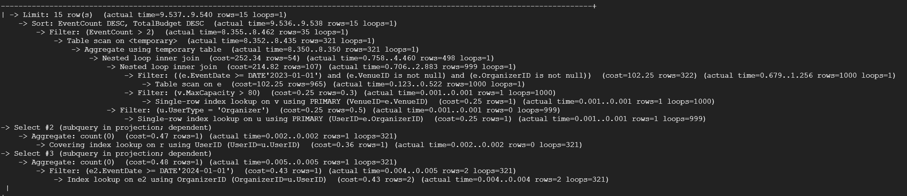

  ## Index 1 : CREATE INDEX idx_maxcapacity ON Venues (MaxCapacity);
  ### Reason for No Improvement:
   - If MaxCapacity is not used for filtering or sorting in the query frequently (for example, if it’s only used for occasional joins but not heavily filtered), this index won’t be used effectively.
   - The small dataset size means the query could execute without any noticeable delay, so the index doesn't result in a performance boost.
  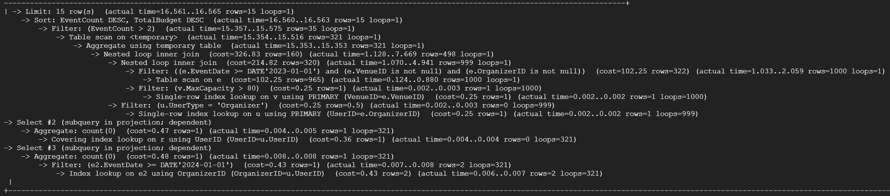

  ## Index 2 : CREATE INDEX idx_usertype ON Users (UserType);
  ### Reason for No Improvement:
   - If the query does not filter by UserType or if the UserType column has a limited number of distinct values, then the database might not use the index.
   - The small size of the dataset likely means a full scan would be just as fast as using an index.
  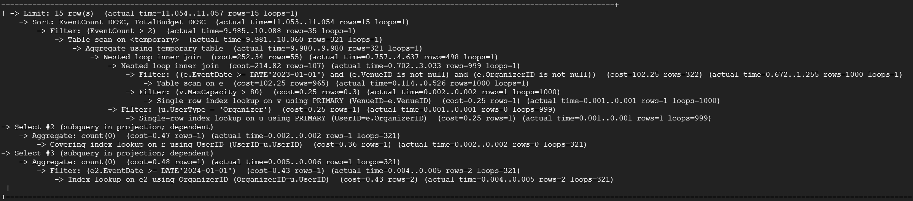

  ## Index 3 : CREATE INDEX idx_eventdate_eventtype ON Events (EventDate, EventType);
  ### Reason for No Improvement:
   - If the query does not filter or sort heavily by both EventDate and EventType, or if the dataset is small enough that a full scan or direct access is efficient, the composite index will not be used to improve performance.
   - The small dataset might lead the database engine to choose a full table scan over using the index, particularly if the indexed columns aren't central to the query's filtering or sorting conditions.
  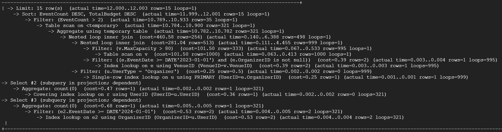

- ## Query 3 : Vanilla Query performance before indexing
  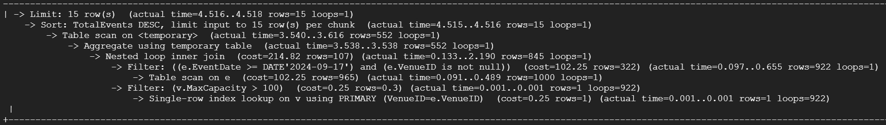

  ## Index 1 : CREATE INDEX idx_maxcapacity ON Venues (MaxCapacity);
  ### Reason for No Improvement:
   - If MaxCapacity is not being used for filtering or joining, or if the query does not require efficient lookup for this column, this index will have little to no effect on performance.
   - For smaller datasets, even without the index, the query might still execute efficiently.
  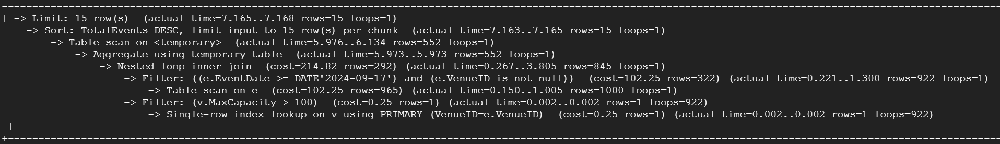

  ## Index 2 : CREATE INDEX idx_events_eventdate ON Events (EventDate);
  ### Reason for No Improvement:

    - The EventDate column may not be heavily used in filtering or sorting. If the query is not performing operations that heavily depend on EventDate, the index might not be leveraged.
    - If the dataset size is small, the database could process the query without needing to use the index.
  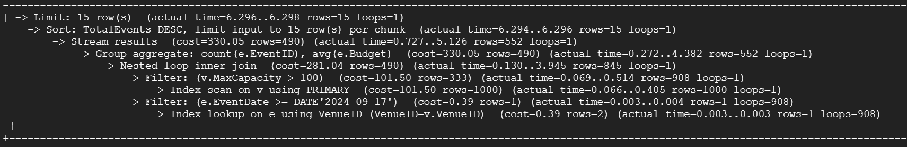

  ## Index 3 : CREATE INDEX idx_events_eventdate_budget ON Events (EventDate, Budget);
  ### Reason for No Improvement:
   - This composite index would only improve performance if both EventDate and Budget are involved in filtering or sorting in the query. If the query does not filter by both columns together, the index will not be useful.
   - A small dataset means the query might be processed efficiently without needing to use the index.
  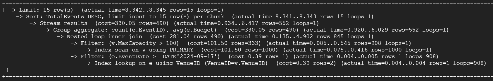

- ## Query 4 : Vanilla Query performance before indexing
  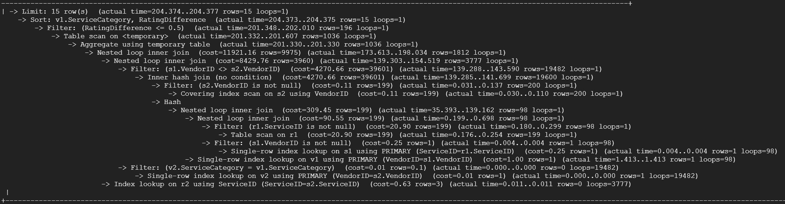

  ## Index 1 : CREATE INDEX idx_vendors_servicecategory ON Vendors (ServiceCategory);
  ### Reason for No Improvement:

   - If ServiceCategory is not used frequently for filtering or sorting in the query, or if it’s part of an operation that doesn’t benefit from indexing, the index will not have an impact.
   - Small datasets make the impact of such an index less noticeable, as full scans can be just as fast.
  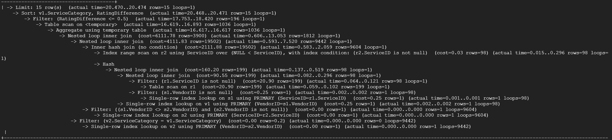

  ## Index 2 : CREATE INDEX idx_reviews_servicecategory_rating ON Reviews (Rating);
  ### Reason for No Improvement:

   - If Rating is not heavily involved in filtering or sorting, the index won't provide a noticeable benefit. A table scan may be as efficient for smaller datasets.
  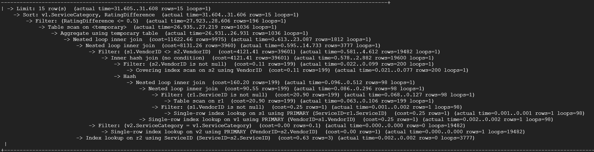

  ## Index 3 : CREATE INDEX idx_vendors_servicecategory_baseprice ON Vendors (ServiceCategory, BasePrice);
  ### Reason for No Improvement:

   - This composite index would help if the query filters by both ServiceCategory and BasePrice together. If the query only uses one of these columns or doesn’t involve them heavily in filtering, the index will not be used.
   - In the case of a small dataset, the database can efficiently handle the query without needing to use the composite index.
  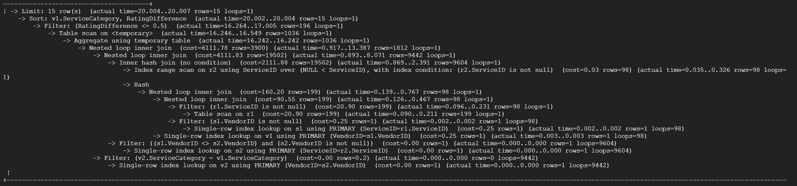

## Indexing effect:

## Indexing effect:
- Given the findings from the analysis, the indexing strategy implemented did not yield noticeable performance enhancements for the query due to the small dataset size and the nature of the filtering operations. In larger datasets, these indexes would typically improve performance by reducing the time complexity associated with the joins and filtering operations. However, in this case, it appears that the dataset's size allows for efficient processing through direct access, resulting in little to no difference in performance.


